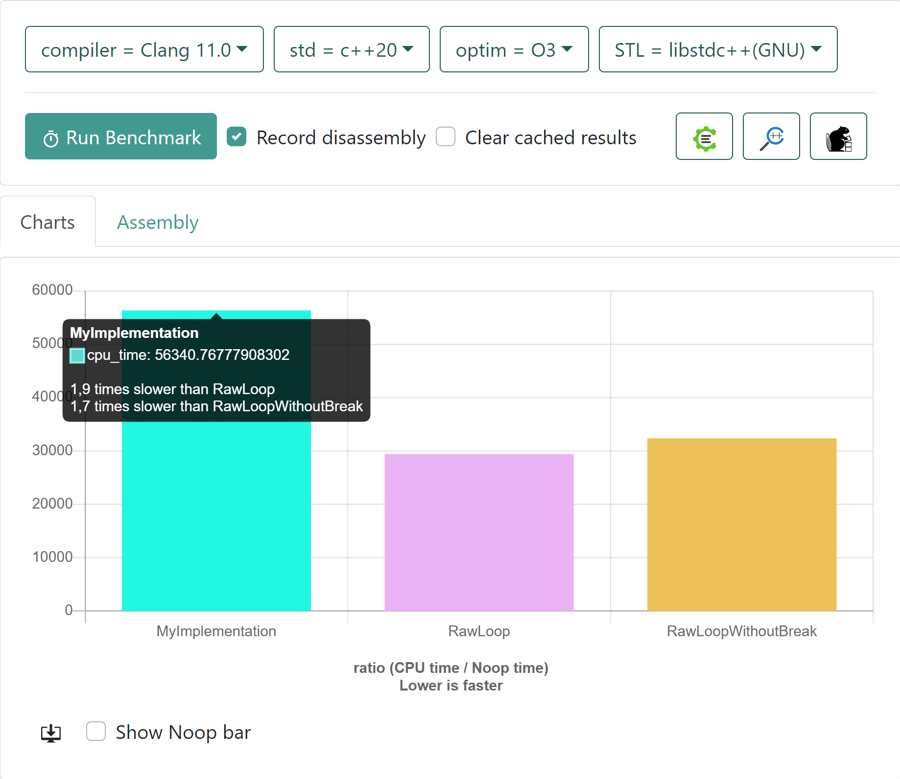
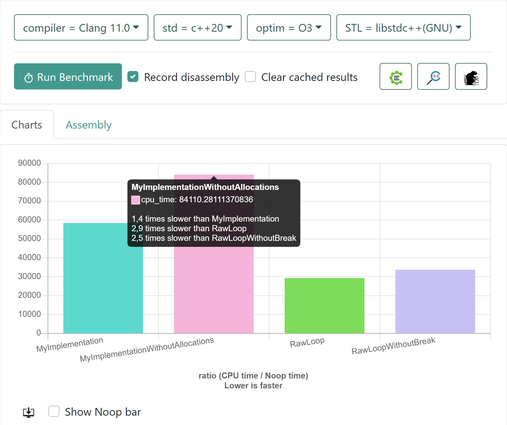

A little while ago I wrote some code that was counting how many points of a given vector of points fall into each quadrant of a region. I already had a function that would return a list of indices for a region, so here is roughly how I implemented it:

```cpp
#include <vector>
#include <array>

struct Point
{
    float x;
    float y;
};

struct Region
{
    Point top_left;
    Point bottom_right;

    [[nodiscard]] constexpr bool contains(const Point& point) const noexcept
    {
        return point.x > top_left.x && point.x < bottom_right.x && point.y > top_left.y && point.y < bottom_right.y;
    }
};

[[nodiscard]] std::vector<std::size_t> indices_in_region(const std::vector<Point>& points, const Region& region)
{
    std::vector<std::size_t> result;
    result.reserve(points.size());

    for( std::size_t i = 0; i < points.size(); ++i)
    {
        if( region.contains(points[i]))
        {
            result.emplace_back(i);
        }
    }
    return result;
}

std::array<Region,4> region_quadrants(const Region& region)
{
    auto half_width = region.bottom_right.x - region.top_left.x;
    auto half_height = region.bottom_right.y - region.top_left.y;
    return {
        Region{Point{region.top_left}, Point{region.top_left.x + half_width, region.top_left.y + half_height}},
        Region{Point{region.top_left.x + half_width, region.top_left.y}, Point{region.bottom_right.x, region.top_left.y + half_height}},
        Region{Point{region.top_left.x + half_width, region.top_left.y + half_height}, region.bottom_right},
        Region{Point{region.top_left.x, region.top_left.y + half_height}, Point{region.top_left.x + half_width, region.bottom_right.y}}
        };
}

int myImplementation()
{
    auto points = create_n_random_points(2000);
    auto regions = region_quadrants(Region{Point{0.0F,0.0F}, Point{100.F,100.F}});

    for( const auto& region : regions)
    {
        auto count = indices_in_region(points, region).size();
    }
}
```

I thought this was quite straightforward and I could reuse my function for computing the indices. However my collegue pointed out in a review that with this approach I am creating 4 new vectors and iterating 4 times over the complete sequence. He suggested to simply iterate once and increment a counter for the corresponding region.

Something like this:
```cpp
int rawLoop()
{
    auto points = create_n_random_points(2000);
    auto regions = region_quadrants(Region{Point{0.0F,0.0F}, Point{100.F,100.F}});
    std::array<size_t, 4> counters{0,0,0,0};
    for(const auto& point : points)
    {
        for( size_t i = 0; i < counters.size(); ++i)
        {
            if( regions[i].contains(point))
            {
                ++counters[i];
                break;
            }
        }
    }
}
```

So since this is about C++ and performance I was curious, how much does it actually matter and will it make the code more or less expressive.

This blog post is here to document the result of the experiment. I already knew that for our use case we will have aournd 2000 points, so I stuck to that and did a quick comparison on [https://quick-bench.com/q/ZqyQ08se78fohsSdPkFgFqldfvI](quick-bench).

You can see the result in the following graph. I am actually a little suprised, I expected more of a difference than the 1.8 factor. Considering the allocations of the vector and the advantage that we can break earlier I thought the speedup would be more.



I added another RawLoop to check the impact of the break when we can terminate early but the effect is not very big , its a factor of 0.2 compared to my implementation that we gain.

What is left is probably used for the four vector allocations that we have. Lets try to eliminate them to confirm that suspicion. I tried with an out parameter instead of returning the vectors from function, I would hand in a vector, clear it and just append to it. [Here](https://quick-bench.com/q/ZwXa8jORXH766-VWIj0IIpZUCi4) is the benchmark and this is the results:



**It actually got slower**. I do not really have an explanation for that however I guess that the compiler is really good at optimizing when the code is straightforward and uses return values. 
However when using out parameters it is probably harder to predict what is gonna change and the optimization has to be more careful. That is my guess.

### What I finally did

In the end I just did some minor improvements but did not choose the nested loop approach because I think it is harder to understand and not worth the impact.

This code is not on the hot path therefore it is unlikely that optimizing it has a meaningful impact therefore I left the function close to the original. I was orginally comparing against a threshold so I could abort early and the function should look clear as day to any poor soul having to maintain my code.

```cpp
auto points = create_n_random_points(2000);
auto regions = region_quadrants(Region{Point{0.0F,0.0F}, Point{100.F,100.F}});

for( const auto& region : regions)
{
    auto count = indices_in_region(points, region).size();
    if( count < threshold)
    {
        return false;
    }
}
return true;
```

### My Learnings from this exercise
* Out parameters can be bad for performance
* Don't force the reuse of existing functions
* Make a conscious decision of performance vs expressiveness